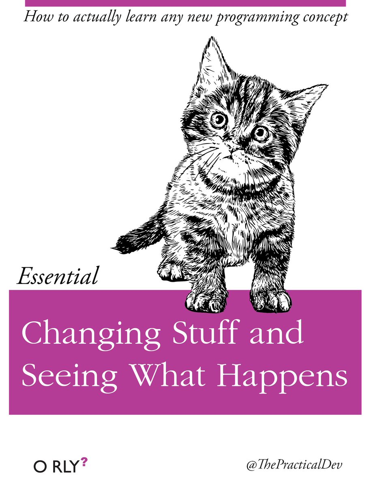

# IMAGES AND VIDEO
* Make sure you are logged-in to the editor
* Open the `Sketch Files` tab (the arrow above the top left corner of the coding window)
* Select `Upload file`
* Drag/Drop media files
## Images
* Image Formats: JPG, GIF, PNG, SVG
* Images can load in the background
* `preload()` event
* `loadImage()` function
```js
function preload() {
    img = loadImage('assets/img/cat.jpg')
}
```

```js
function draw() {
    image(img, 0, 0)
    // image(img, x, y, width, height)
}
```

* `img.width` and `img.height`

## Typography
* accepts `.ttf` and `.otf` files
* dowload from web or use https://fonts.google.com/
* `textFont()`, `loadFont()` and `textSize()`
```js

let myFont;
function preload() {
  myFont = loadFont('assets/inconsolata.otf');
}

function setup() {
  fill('#ED225D');
  textFont(myFont);
  textSize(36);
  text('p5*js', 10, 50);
}

function draw() {
  text('Hello World', x, y, width, height)
}
```

## More P5.js Concepts
* `push()` and `pop()` are used to save and restore the current drawing state
* `rotate()`, `translate()`, `scale()`, and `shear()` are used to change the current transformation matrix
* `bezier()`, `quadraticVertex()`, and `curveVertex()` are used to draw Bézier curves
* `noLoop()` and `loop()` are used to control whether the `draw()` function continuously executes

## Pixels

* `pixels[]` is an array of the values in the image data
* `loadPixels()` is used to load the pixel data for the image into the `pixels` array
* `updatePixels()` is used to update the image with the data in the `pixels` array
* `get()` and `set()` are used to access and set the individual pixels in the `pixels` array
* `set()` is used to set the color of a single pixel

## color picker
```js
let img;
function preload(){
  img = loadImage("land.jpg");
}

function setup() {
  createCanvas(400, 400);
  stroke(255);
}

function draw() {
  // image(img,0,0,width,height);
  set(0, 0, img); // set() replaces every pixel on the canvas with pixels of img
  let c = get(mouseX, mouseY); // get() grabs the color of the pixel right underneath the cursor and store it inside c
  fill(c);
  rect(50,50,50,50);
  updatePixels(); 
}
```
## process an image
```js
let cat;

function preload() {
  cat = loadImage('cat.jpg');
}

function setup() {
  createCanvas(cat.width, cat.height)
}

function draw() {
  cat.loadPixels();
  for (var y = 0; y < height; y++) {
        for (var x = 0; x < width; x++) {
          var index = (x + y * width)*4;
          cat.pixels[index+3] = random(255);    
        }
      }
  cat.updatePixels();
  image(cat, 0, 0, width/4, height/4);
}
```
## live camera

* `video = createCapture(VIDEO)`
* https://editor.p5js.org/codingtrain/sketches/B1L5j8uk4
```js
// Daniel Shiffman
// https://thecodingtrain.com
// https://youtu.be/WCJM9WIoudI
// https://youtu.be/YqVbuMPIRwY
let video;

let x = 0;

function setup() {
  createCanvas(800, 240);
  pixelDensity(1);
  video = createCapture(VIDEO);
  video.size(320, 240);
  background(51);
}

function draw() {
  video.loadPixels();
  let w = video.width;
  let h = video.height;
  copy(video, w/2, 0, 1, h, x, 0, 1, h);
  x = x + 1;
  if (x > width) {
    x = 0;
  }
}
```
### WebCam ASCII

```js
let webCam;

function setup() {
  createCanvas(480, 240);
  pixelDensity(1);
  webCam = createCapture(VIDEO);
  webCam.size(width, height);
  webCam.hide();
  noStroke();
  fill(0);
}

function draw() {
  background(255);
  webCam.loadPixels();
  stepSize = 4
  for (let y = 0; y < height; y+=stepSize) {
    for (let x = 0; x < width; x+=stepSize) {
      const i = (y * width + x) * 4;
      fill(webCam.pixels[i], webCam.pixels[i+1], webCam.pixels[i+2], webCam.pixels[i+3], webCam.pixels[i+4])
      textSize(stepSize*2)
      text(char(webCam.pixels[i]%128), x, y);
    }
  }
}
```
### https://www.mathiasbernhard.ch/ascii-art-with-p5js/
```js
let resdiv;
var options = [' ','`','.',',-',"':",';_~','"','*|','!l',
'+=','>','<L','\\i','/^','1?','Jv','r','()cx','7}','sz','3u','2Ckty{','jn','4FVY','5P[]af','qw','Sde','Eo',
'NOZ','9HXgh','GTU','$AIm','QW','KM','%8','#06@','bp',
'D','&','R','B'];

var capture;
var pg;

function setup() {
  resdiv = createP('');
  
  pg = createGraphics(160,120);
  capture = createCapture(VIDEO);
  capture.size(160, 120);
  capture.hide();
  
  background(255);
}

function draw() {
  pg.image(capture,0,0,160, 120);
  var res = '<pre>';
  for (var i=0; i<height; i++) {
    var line = '';
    for (var j=0; j<width+height; j++) {
      var x = pg.get(round(j*1.143),i*2);
      var f = (1-x[0]/255.0);
      f = f*f;
      var v = round(f*40);
      var index = floor(random(options[v].length));
      var chr = options[v][index];
      if (chr==' ') chr='&nbsp;';
      if (chr=='<') chr='&lt;';
      if (chr=='>') chr='&gt;';
      if (chr=='"') chr='&quot;';
      line += chr;
    }

    res += line+'<br>';
  }
  res += '</pre>'
  resdiv.html(res);
}
```

## READING

* https://idmnyu.github.io/p5.js-image/

## FILTERS
* THRESHOLD - Converts the image to black and white pixels, parameter between 0.0 and 1.0
* GRAY - Converts any colors in the image to grayscale equivalents
* OPAQUE - Sets the alpha channel to entirely opaque
* INVERT - Sets each pixel to its inverse value
* POSTERIZE - Limits each channel of the image to the number of colors specified as the parameter
* DILATE - Increases the light areas
* BLUR - Executes a Gaussian blur with the level parameter
* ERODE - Reduces the light areas

## SHADERS
* https://github.com/aferriss/p5jsShaderExamples#image-effects

